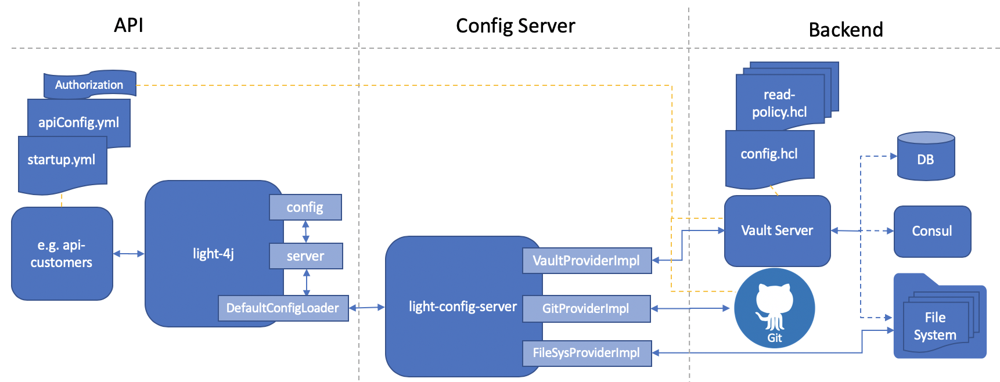

# light-config-server
A restful light config server that supports pluggable backends like database, Consul, Vault and GitHub etc.

**Design Details**: [Config Server Design](docs/DESIGN.md)

**Provider Storage**: [How to Prepare Provider Storage](docs/PROVIDERS.md)

**Usage Details**: [How to Use](docs/USAGE.md)

