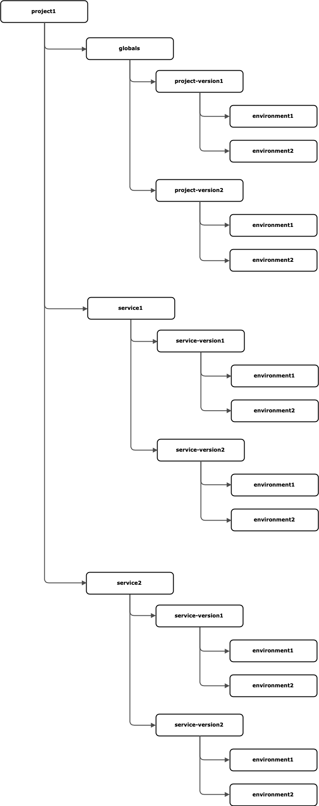

Config Server Design
========================
### 1. Introduction 
The config server allows an API to externalize and share its environment specific parameters across services in a way
that is easy to maintain and secure.   

Examples of fields that should be externalized: 
1. Database server host and port, user ID and password, DB schema, etc  
2. Service registration server’s url and connection properties 
3. Log file location and log level 


##### Functions of the configuration server: 
1.	Customized configuration options based on the API's version and environment
2.	Global (shared) configuration at the project level
3.	Secure, encrypted at rest storage of the sensitive data
4.	Access control with ability to limit access at the project level
5.	Simple REST based client interface
6. Open backend architecture with pluggable storage providers
7. Easy integration with the light-4j framework
8.	Simple run-time client configuration

### 2. Configuration Structure 
API is defined by a unique service name which should not include any version information.  
Each API can have multiple release versions. Versions defined for the purpose of the config server can map into the
release versions of the API however they do not have to. Technically new version of the config should be introduced only
when the structure of the configuration changes significantly.  
Further down, configuration artifacts are defined at the environment level (for example sit1, sit2, etc).  
For the purpose of sharing configurations, multiple services (APIs) are grouped into projects. Project has its own
versions, independent of the API versions. Again the project version should be introduced only when there is a
significant change in the config structure.   
Global (shared) config artifacts can be defined at the project level.   
This is done at the project version and environment level. 

Logical structure of the configuration, from the project level (may vary for different providers):  



### 3. Configuration Templates   
Configuration templates are configuration files with the externalized values replaced with the placeholders (tokens).
When the service starts up, those placeholders will be replaced with the values specific for the runtime environment.  
Example that will accept the value of the HTTPS_PORT key from the config server and default to 8080 if not available:
``` 
httpsPort: ${HTTPS_PORT:8080} 
```
Not every value in the configuration template needs to be externalized. At the design / development time a developer
will decide which values will be externalized and which ones are static and built into the deployed code.   
In the light-4j framework, the module config files become the templates (server.yml, client.yml,...).   
Configuration templates will be stored in the APIs resources folder and built into the resulting jar file at the build
time. This will ensure that the version of the template matches the version of the API itself.   
Full details of environment injection can be found here:
https://doc.networknt.com/concern/config/#environment-external-config-injection 

### 4. Externalized Configuration 
Config server provides ways for externalizing three types of artifacts:
1.	Configuration parameters - key / value pairs which can be inserted into configuration template files at runtime.
2.	Certificate keystores and truststores 
3.	Third party configuration files

Each of the above configuration artifacts can be defined at two level:
1.	Project scope: APIs can share key/value pairs within the same project scope.
2.	Service (API) scope: Defined for a specific API.
Artifacts in the service scope overwrite artifacts in the project scope.

#### Configuration Parameters 
Configuration parameters are defined as key/value pairs. They provide values that are specific for each of the API
versions and environments where the API is running.   
Each externalized configuration parameter should have a unique name (within the scope of an API).   
At the startup time the API connects to the configuration server and requests all externalized parameters and their
values for the environment and version of the running API. Those values are then inserted into the placeholders in the
configuration templates. The result is the set of configuration files with proper values for the current environment.   
Since the value injection is based on the values.yml approach it would be easy to overwrite the values retrieved from
the config server with the values injected through the environment variables.  
Developers would prepare values.yml and other files locally and use it for their testing without having to connect to
the config server. This will make the integration with config server transparent to the client code and enable local
testing without connection to the config server.

#### Certificate Keystores and Truststores 
Keystores and trusstores are stored on the config servers as key / value
pairs, where key represents the file name and value is a Base64 encoded content of the keystore or truststore. At the
API startup these files will be downloaded from the config server and stored in the local filesystem (as specified in
JVM options at startup). Passwords for the keystores and trust stores are defined in the configuration parameters.

#### Third Party Config Files 
Any third party configuration file can be stored as a key / value pair where key represents the file name and value is a
Base64 encoded content of the file. At the API startup these files will be downloaded from the config server and stored
in the local filesystem (as specified in JVM options at startup). This solution does not provide placeholder replacement
for the third party files. Since the whole file is externalized this should not be an issue (each environment has its
own file in the config server). 


### 5. Persistent Storage 
Config server can be configured to use different implementations (providers) for the key/value pair storage. There can
be only one provider per config-server instance (cannot mix the providers within the same instance).   
Config server supports these providers:
1) Vault
2) Git
3) File system

Light config server’s API will provide a standardized abstraction layer on top of the provider’s API so that providers
can be switched if needed.   
Additional provider implementations can be added if required (for example UrbanCode vault or similar storage provider).


**Encryption:**   
Configuration values will be encrypted before they are persisted. The actual encryption will be handled by the
persistence provider. Vault provides encryption functionality for persisted values.

**Decryption:**   
Decryption will be handled by the persistence provider. Values will be returned to the caller API in the decrypted
(plain text) form over an encrypted connection. On the client side the values will be kept only in memory and never
saved to the files on the local file system (except for the third party files not handled by the framework).


### 6. Config Server API 
Functions of the config server will be exposed as restful APIs. This provides simple integration with clients written in
Java or any other technology (non Java based applications can use the same config server). Config server can be deployed
in a container or as a stand alone application in a VM or physical server.   
APIs are divided into two groups:
1. Management APIs provide methods for managing configuration data:   
  o	Service registration  
  o	Key / value management  
  o	Encryption settings  
2. Query APIs provide methods for retrieving service information and key/value pairs:   
   o	List of services: /config-server/services  
   o	Key / value pairs for values.yml:
   /config-server/configs/{project_name}/{project_version}/{service_name}/{service_version}/{environment}   
   o	Key stores and trust stores:
   /config-server/certs/{project_name}/{project_version}/{service_name}/{service_version}/{environment}   
   o	Third party files:
   /config-server/files/{project_name}/{project_version}/{service_name}/{service_version}/{environment}

OpeAPI spec for the config server API:   
[Config Server OpenAPI Spec](../src/main/resources/config/openapi.yaml)


### 7. Config Server UI 

Config server will rely on the storage providers to implement their own UI for managing service
registration and the key value pars. Vault implements a simple web based UI and it also provides command line interface
for managing key / value pairs. 

### 8. Authorization 

APIs will have to be authorized in order to be able to access config server. Authorization method will depend on the
config provider. For the Vault provider API will have to be given a proper client id and password which they will need
to pass in the Authorization header as Base64 encoded Basic authorization token when calling config server. While for
Git provider, its GIT API Bearer authorization token.

### 9.Client Keystore and Truststore:   
In order to make the initial connection to the config server during the startup, the API will need to provide a basic
keystore and truststore which can be used for connecting to the config server.  
Passwords for those also need to be provided. These will be used only during the startup. Once configuration is
downloaded from the config server, the proper key stores and trust stores will be injected, together with their
passwords.

### 10. Config Server Architecture

